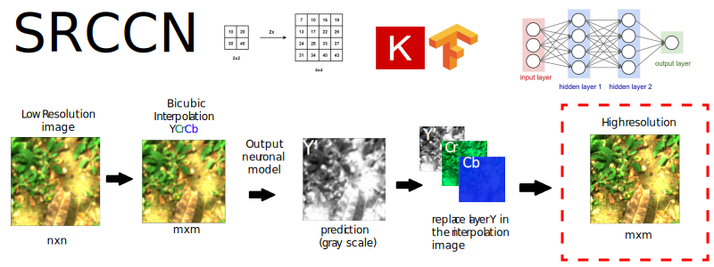
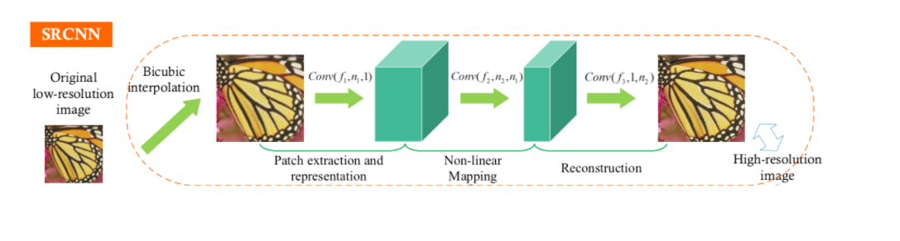

# VQ-GAN-superresolution

Este proyecto es desarrollado por Frans Guillermo Taboada, Andres Felipe Rojas Santos, Juan Pablo Claro Perez.

## Objetivo
Aumento de la resolucion de una imagen (borrosa y escalada).

## Dataset
http://icvl.cs.bgu.ac.il/hyperspectral/

todas las imagenes que selecionaron fueron las contenidas en los archivos .mat, de estos se selecciona unicamente las imagenes rgb de 1304x1392.

las recotarlas en imagenes de 256x256 en formato de colores YCbCr, y las disminuimos a 192x192 pixeles para luego aplicar un filtro blur.
Del formato YCbCr se utiliza la capa de color Y que contiene una representacion en escala de grises de la imagen.

## SRCNN (Modelo utilizado)

## Referencias
srcnn proyecto de referencia

https://colab.research.google.com/github/goodboychan/chans_jupyter/blob/main/_notebooks/2020-10-13-01-Super-Resolution-CNN.ipynb#scrollTo=FbB6JeIzz7lT

TensorFlow modelo

https://colab.research.google.com/github/tensorflow/docs-l10n/blob/master/site/es-419/guide/keras/save_and_serialize.ipynb#scrollTo=DE4b3ndNyQh3
